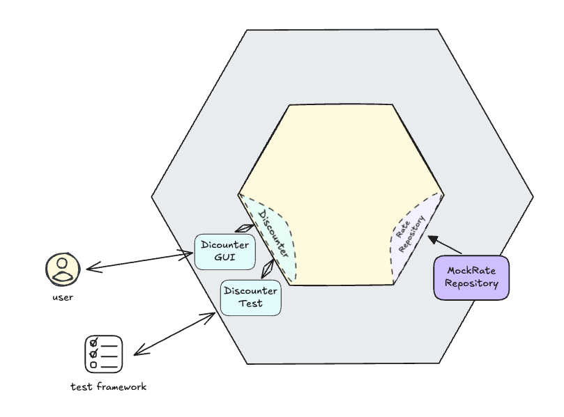

# General notes
This is an example from [OG Hexagonal Architecture articitle written by Alistair Cockburn](https://alistair.cockburn.us/hexagonal-architecture/). 
It is described in "Sample Code" section, which I find hard to understand as it uses [FIT](https://en.wikipedia.org/wiki/Framework_for_integrated_test) tool for automated tests and doesn't contain all of the required code. 
This repository contains project described in the mentioned section created with usage of Scala, [MUnit](https://scalameta.org/munit/) test framework and scala-swing.

The architecture is presented on the image below:

# How to run code?
Use [scala-cli](https://scala-cli.virtuslab.org/) for running the code. Once you have `scala-cli` installed, you can run (either from root of the project or `src` directory):
* run tests using `scala-cli test .`
* run UI application using `scala-cli .`
